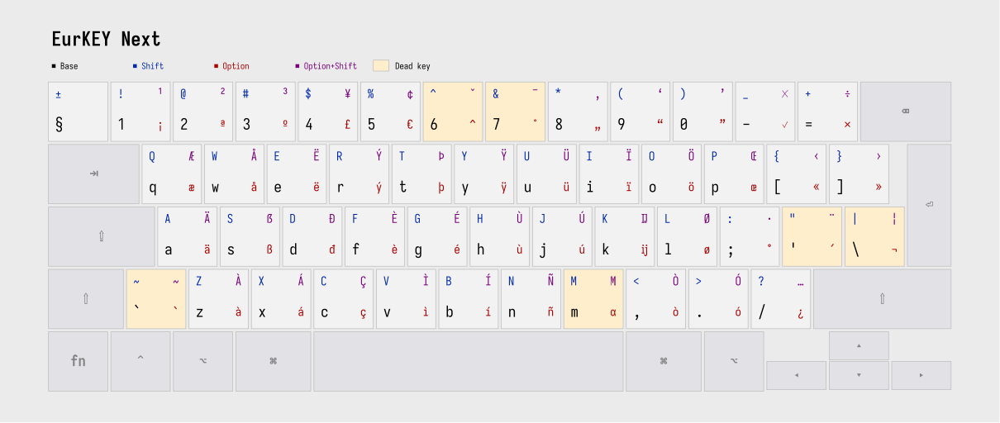

# EurKEY - macOS

Bundle that worked for me, using the EurKEY-Next keylayout and icon from [felixfoertsch/EurKEY-Next](https://github.com/felixfoertsch/EurKEY-Next) (which won't show on lock screen for me for some reason) with some of the bundle settings from [sonicdoe/EurKEY](https://github.com/sonicdoe/EurKEY).

## Removing other input sources

1. First, try to lock the screen, select the other input source and "Remove current input source"; If the option is greyed out:
2. Export your current keyboard settings by running: `defaults export com.apple.HIToolbox -`
3. Copy the block representing EurKEY Layout. E.g.:
    ```
    <dict>
        <key>InputSourceKind</key>
        <string>Keyboard Layout</string>
        <key>KeyboardLayout ID</key>
        <integer>16383</integer>
        <key>KeyboardLayout Name</key>
        <string>EurKEY</string>
    </dict>
    ```
4. Wipe out the existing layouts: `defaults delete com.apple.HIToolbox AppleEnabledInputSources`
5. Add your custom layout back: `defaults write com.apple.HIToolbox AppleEnabledInputSources -array-add 'your xml'`. E.g.:
   ```
   defaults write com.apple.HIToolbox AppleEnabledInputSources -array-add '<dict><key>InputSourceKind</key><string>Keyboard Layout</string><key>KeyboardLayout ID</key><integer>16383</integer><key>KeyboardLayout Name</key><string>EurKEY</string></dict>'
    ```
6. Reboot and pray

## Layout


